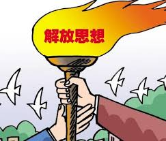

# 茶座的结束，写作的开始

2016年9月25日，在这个平凡的日子里，一群有趣的人聚在一起讨论着一个不平凡的话题——__区块链__。期间来自资本，银行，消费金融，能源等各个领域的声音，着实给我这颗榆木脑袋开了一回光，也点燃了我对于区块链__这个为信用而生的技术__的激情。

区块链作为一种信用体系，它的发展是离不开人们的认可的。在我所接触到的学习资料中，ebookcoin项目的发起人imfly所写的《Nodejs开发加密货币》算是对于技术人员非常友好的资料了，但是对于非技术人员的门槛还是有一些高。喜欢分享知识的我，希望通过自己的努力，打破这个壁垒，用通俗易懂的语言让更多的人了解区块链。

# 区块链加

由于区块链的整个技术体系来自于bitcoin（一款电子加密货币），所以很多人的思路会被限制在货币这个视角内。  

但是，作为接受党多年教育的我们，怎么能满足于此囊。  

实际上，区块链技术所解决的核心痛点是信用问题。如果能像到这一点的话，那么区块链就可以作为一个工具来跟许多的行业做加法了。  

借用李总理的表述方式就是，区块链+。

