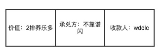

了解一个人的有效方法是，了解这个人的过往；了解一件事的有效途径，也是回顾整个事件发生的经过。对于区块链的研究也是如此，了解它的前世今生，可以很好的理解区块链是什么，解决了什么问题，是如何解决的。

### 欠条

区块链的本质是一个账本，那么我们就从最简单的账本开始谈起。

话说，不靠谱闪和wddlc是同事关系，他们对于中韩足球之战打了个赌，各自出1排养乐多。由于国足在党的领导下完虐韩国队，所以wddlc获胜了，但是不靠谱闪最近懒得去超市，想等到有空的时候去买，于是，就给了wddlc一张欠条，内容如下图：

### 三式记账法

### 数字签名

### 区块链