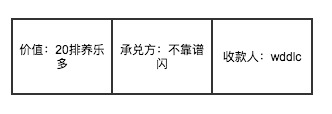
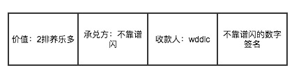

了解一个人的有效方法是，了解这个人的过往；了解一件事的有效途径，也是回顾整个事件发生的经过。对于区块链的研究也是如此，了解它的前世今生，可以很好的理解区块链是什么，解决了什么问题，是如何解决的。

### 欠条

区块链的本质是一个账本，那么我们就从最简单的账本开始谈起。

话说，不靠谱闪和wddlc是同事关系，他们对于中韩足球之战打了个赌，各自出1排养乐多。由于国足在党的领导下完虐韩国队，所以wddlc获胜了，但是不靠谱闪最近懒得去超市，想等到有空的时候去买，于是，就给了wddlc一张欠条，内容如下图：

欠条两个人一人一张，但是，等到一周后wddlc找不靠谱闪兑现养乐多的时候，不靠谱闪的欠条却变成了下面的样子：

__通过上面这个小故事，可以发现欠条这种记账的方式很不可靠，轻易的就会被篡改掉。__  将上面的场景应用到，陌生人与陌生人之间，并且资金数量具有一定规模的场景中，这种不可靠性会使得交易无法进行下去，对于投资方和融资方来说都是一种损失

### 三式记账法

针对欠条不足，人们稍作改进，形成了三式记账法，我们还是用一个小故事来介绍这种进化的记账方法

书接上回，不靠谱闪和wddlc，对于中伊之战又设立了一个赌约，还是各自出1排养乐多，不靠谱闪这回又输了。为了防止不靠谱闪违约，这次wddlc叫来了另一个同事万人贤，账目采用一式三份的形式，wddlc、不靠谱闪、万人贤各持一份，如果当事人发生纠纷，以第三方的为准，内容如下：

上次被坑了之后wddlc一直耿耿于怀，于是wddlc找到了万人贤，要求把欠条的价值改为20排养乐多，多余的18排，一人一半。万人贤一定当时就心花怒放，于是欠条就成了下面的样子:

一周后，wddlc去找不靠谱闪承兑养乐多，两人欠条不一样，于是就找到万人贤来评理，结局我就不多说了^-^

三式记账法是我们目前经常使用的方法，比如我们去租房的时候，租房合同一般都是一式三份的，当房东和房客之间发生就纠纷，就会找到中介。

__但是，这种记账方式的问题在于，对于第三方的素质要求很高。__  在北京租过房的人都知道，素质比万人贤高的中介应该没有几个吧。因此，对于这种去第三方的需求就因运而生，我们将在下一节中介绍

### 数字签名

数字签名是非对称加密的一种应用场景，非对称加密需要两个密钥来进行加解密，一个密钥是公开的称为公钥，一个密钥需要保密称为私钥，可以用下面的公式总结非对称加密

> 密钥A + 数据 = 密文  
> 密钥B + 密文 = 数据

数字签名则是，使用私钥加密后形成的一段密文

把数字签名引入我们的账本中：

* 不靠谱闪的私钥 + 欠条的信息  = 数字签名
* 结果如下

我们来分析一下，这张欠条尾部附加了一枚数字签名，也就是说无论谁修改了内容，数字签名都会失效，也就是说这张欠条具有不可篡改的性质，承兑方和收款方都无法作假

好了目前看来，我们的方案已经完美无缺了，但是，真的是这样吗？

##### 双花攻击

书接上回，wddlc收到了不靠谱闪的欠条后，特别开心到处跟其他同事打赌。俗话说得好，常在河边走，哪有不湿鞋，这不他就输给了大成哥和小成哥没人两排养乐多。不过他早已经有所准备，他把带有数字签名的欠条复制了两份，分别给了大成哥和小成哥。  

一周后，大成哥和小成哥分别拿着欠条去找不靠谱闪承兑，后面的悲剧大家自己脑补吧^-^

所谓的双花就是将手中的钱花了两遍，这也就是区块链技术解决的核心问题，在下一节中我们一起来看一下区块链是如何解决的把

### 区块链