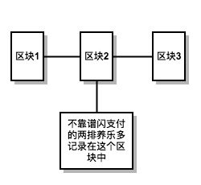
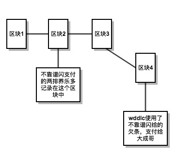
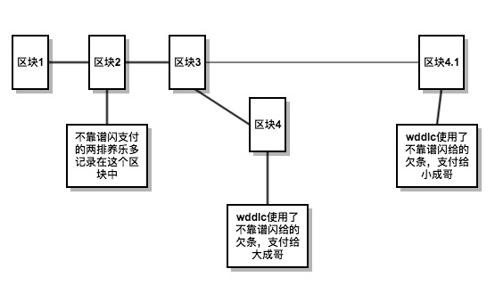
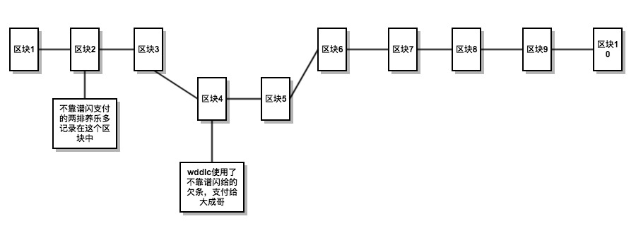

了解一个人的有效方法是，了解这个人的过往；了解一件事的有效途径，也是回顾整个事件发生的经过。对于区块链的研究也是如此，了解它的前世今生，可以很好的理解区块链是什么，解决了什么问题，是如何解决的。

### 欠条

区块链的本质是一个账本，那么我们就从最简单的账本开始谈起。

话说，不靠谱闪和wddlc是同事，他们对于中韩足球之战打了个赌，各自出1排养乐多。由于国足在党的领导下完虐韩国队，所以wddlc获胜了，但是不靠谱闪最近懒得去超市，想等到有空的时候去买，于是，就给了wddlc一张欠条，内容如下图：

欠条两个人一人一张，但是，等到一周后wddlc找不靠谱闪兑现养乐多的时候，不靠谱闪的欠条却变成了下面的样子：

__通过上面这个小故事，可以发现欠条这种记账的方式很不可靠，轻易的就会被篡改掉。__  将上面的场景应用到，陌生人与陌生人之间，并且资金数量具有一定规模的场景中，这种不可靠性会使得交易无法进行下去，对于投资方和融资方来说都是一种损失

### 三式记账法

针对欠条不足，人们稍作改进，形成了三式记账法，还是用一个小故事来介绍这种进化的记账方法

书接上回，不靠谱闪和wddlc，对于中伊之战又设立了一个赌约，还是各自出1排养乐多，不靠谱闪这回又输了。为了防止不靠谱闪违约，这次wddlc叫来了另一个同事万人贤，账目采用一式三份的形式，wddlc、不靠谱闪、万人贤各持一份，如果当事人发生纠纷，以第三方的为准，内容如下：

上次被坑了之后wddlc一直耿耿于怀，于是wddlc找到了万人贤，要求把欠条的价值改为20排养乐多，多余的18排，一人一半。万人贤一定当时就心花怒放，于是欠条就成了下面的样子:

一周后，wddlc去找不靠谱闪承兑养乐多，两人欠条不一样，于是就找到万人贤来评理，结局我就不多说了^-^

三式记账法是我们目前经常使用的方法，比如我们去租房的时候，租房合同一般都是一式三份的，当房东和房客之间发生就纠纷，就会找到中介。

__但是，这种记账方式的问题在于，对于第三方的素质要求很高。__  在北京租过房的人都知道，素质比万人贤高的中介应该没有几个吧。因此，对于这种去第三方的需求就因运而生，我们将在下一节中介绍

### 数字签名

数字签名是非对称加密的一种应用，非对称加密需要两个密钥来进行加解密，一个密钥是公开的称为公钥，一个密钥需要保密称为私钥，可以用下面的公式总结非对称加密

> 密钥A + 数据 = 密文  
> 密钥B + 密文 = 数据

数字签名则是，使用私钥加密后形成的一段密文

把数字签名引入我们的账本中：

* 不靠谱闪的私钥 + 欠条的信息  = 数字签名
* 结果如下

我们来分析一下，这张欠条尾部附加了一枚数字签名，也就是说无论谁修改了内容，数字签名都会失效，也就是说这张欠条具有不可篡改的性质，承兑方和收款方都无法作假

好了目前看来，我们的方案已经完美无缺了，但是，真的是这样吗？

##### 双花攻击

书接上回，wddlc收到了不靠谱闪的欠条后，特别开心到处跟其他同事打赌。俗话说得好，常在河边走，哪有不湿鞋，这不他就输给了大成哥和小成哥每人两排养乐多。不过他早已经有所准备，他把带有数字签名的欠条复制了两份，分别给了大成哥和小成哥。  

一周后，大成哥和小成哥分别拿着欠条去找不靠谱闪承兑，后面的悲剧大家自己脑补吧^-^

所谓的双花就是将手中的钱花了两遍，这也就是区块链技术解决的核心问题，在下一节中我们一起来看一下区块链是如何解决这个问题的把

### 区块链

导致双花攻击的主要因素在于，当wddlc把欠条支付给小成哥的时候，小成哥并不知道大成哥已经收到过这张欠条了。换句话说，小成哥只知道自己的情况，而不知道交易系统中其他人的情况。

很容易想到的方案就是，交易系统的所有参与者使用一个账本记账，小成哥收到欠条后，先去交易系统的账本中找找看看，是否这个欠条已经支付给了大成哥，如果没有再接受这张欠条。

顺着这个思路继续，想就会发现一个问题，__公共账本到底谁来维护囊？__ 如果，信任某一个或者某几个人就又陷入了三式记账法的问题之中了。那么，我们干脆不指定具体的人去维护账目了吧，每次记账的时候随机找一个参与者记账就好了。

我们先__假设：交易系统可以每隔10分钟，随机的从所有参与者中选取一个参与者出来记账。__我们把这个记账的节点叫做铸币节点（因为每次记录一个区块，会给这个记账人一些奖励）

记账以区块（区块链类比为账簿，区块可以类比账簿上的一页）为单位，选中的记账人将这段时间收到的合法交易，打包成一个区块，放置到自己的区块链上，然后广播给整个系统

每个参与者接收到后，首先，根据本地的区块链验证交易是否双花，如果所有都交易都是合法的，那么接受这个新到的区块，将这个区块放到本地的区块链上去

##### 区块链分叉

把上面的模型带到实际的案例中看一下

开始的时候区块链的状态如下图所示

下面wddlc开始给大成哥两排养乐多，区块链系统选择万人贤来记账，区块链状态如下图所示

假设，wddlc发动双花攻击，将不靠谱闪的欠条再次支付给了小成哥，区块链系统这次选择了磨叽凯进行记账，人如其名，磨叽凯接受区块的速度比较慢（现实中很有可能发生，尤其是一个全球性的支付系统，存在延迟是在所难免的），没有接收到区块4，因此，他将wddlc的双花交易当做了一笔合法的交易，那么此时状态如下

如上图所示，区块链在3号区块后形成了两条路径，就像一个岔道一样。那么，面对这个局面应该怎么做囊，按照中本聪（比特币之父）的设计，每一个被选中的铸币节点，要在最长的一条分叉路上进行记录，如果有两条长度相同的分叉路上，那就随便选择一条就好了

恰巧下一个记账的是wddlc，区块链的状态如下图所示

一个双花攻击就此形成了，但是，在区块链系统中并不是交易被写入区块链就代表支付完成，按照比特币的惯例，一般需要确认6次（既后续又形成6个区块），才算安全。安全的状态如下所示

在这种状态下，即使wddlc被选中发动双花攻击，那他必须从区块3开始生成区块，假设wddlc控制了整个系统50%的参与者，那么这条新的路径增长的速度也只能与原来的路径一样快。只要广大人民群众（系统51%的参与者）拥护区块链系统，那么系统就是安全的

##### 铸币节点的选取

在上面的模型中我们有一个假设的条件：__交易系统可以每隔10分钟，随机的从所有参与者中选取一个参与者出来记账。__ 这个条件实现的方式多种多样，这里仅以最著名的比特币为例  

比特币的选取方式，很简单，比特币系统要求铸币的节点计算hash难题

* 每一个想要知道答案的参赛者，只能通过一次一次的实验完成
* 平均每道题需要花费10分钟的时间来完成

一次一次的实验保证了铸币节点的选取是随机完成的，而时间间隔是通过题目的难度调整的，整个这个过程也就实现了最开始的假设

本文，通过回顾账本在各个历史阶段的形态，发现__区块链技术的革命性在于：使得人们不必再去信任无关的第三方。__ 这种去中心化的特点，有助于人与人之间的生产关系更加的自由与公平，在这种生产关系中进行工作会更加有积极性，最终促进生产力的提高。
